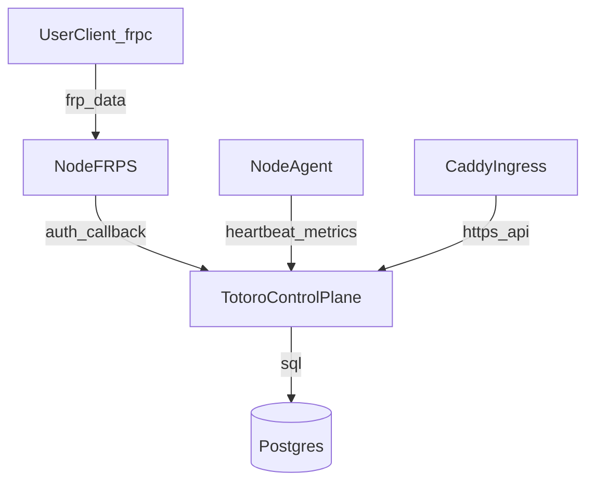
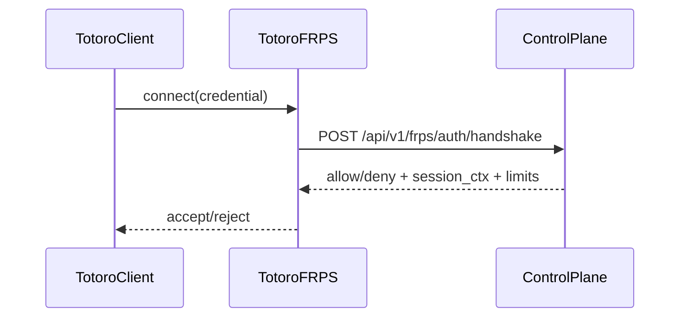

# Totoro 平台架构方案（服务端 + 共享节点）

## 1. 目标与边界

### 1.1 目标

- **开放连接**：客户端可连接任意 `frps`；同时提供“官方节点目录/共享节点”能力。
- **高性能数据面**：保持 `frps/frpc` 的转发性能，平台能力尽量不侵入转发链路。
- **易部署**：官方服务端以 **Docker Compose** 一键交付，默认可直接上线。
- **可运营**：支持节点公开/私有、邀请码分享、基础审计与统计，后续平滑演进至商业化。

### 1.2 非目标（MVP 先不做/不承诺）

- 多区域自动调度、全量计费闭环、复杂风控（留到 Launch 阶段）。
- 深度改写 frp 核心转发逻辑（坚持“数据面最小改造”）。

---

## 2. 架构原则

- **控制面 / 数据面分离**：管理、策略与共享全部在控制面；转发尽量留在 frps。
- **最小可信边界**：frps 不保存复杂业务状态，避免耦合与回滚困难。
- **无注册/无登录**：客户端使用无需注册；连接授权完全依赖 **邀请码核验** 与 **节点密钥校验**。
- **短期票据**：共享节点通过邀请码换取 **短期连接票据**（签名票据，JWT/等价机制），降低泄露风险。
- **可观测性先行**：事件审计、会话与流量统计从第一天就具备最小可用版本。

---

## 3. 组件拆分与职责

### 3.1 totoro-control-plane（控制面，Go）

职责：
- 节点目录（公开列表）、节点管理（公开/私有、端口/域名策略）
- 邀请码（生成/撤销/解析）
- 为 frps 提供 **鉴权/授权回调**（连接握手、代理注册、配额下发）
- 统计与审计（会话、代理、流量采样）

建议形态：
- 一个 Go 服务（Gin/Echo 均可），对外提供 REST API
- 可内置管理后台静态资源（后续可拆）

### 3.2 totoro-frps（数据面，frps 小改造）

保持：
- frps 核心转发能力（TCP/UDP/HTTP/HTTPS/XTCP 等按需）

最小新增（必须）：
- **连接鉴权 Hook**：客户端连接阶段回调控制面，得到 allow/deny + 会话/配额上下文
- **代理注册鉴权 Hook**：proxy 申请阶段回调控制面，得到 allow/deny + 端口/域名分配与限制
- **配额/限流 Hook**：按“邀请码/代理/节点”限制并发、端口范围、带宽/流量（分阶段落地）

可选新增：
- `/metrics` 输出（Prometheus）或内部统计接口（供 node-agent 拉取）

### 3.3 totoro-node-agent（节点侧 Sidecar，可选但强烈建议）

职责：
- 节点自注册/心跳（节点在线状态、版本信息）
- 采集系统指标（CPU/内存/磁盘/带宽）、frps 指标（连接数、代理数、流量）
- 作为节点“控制通道”，承接控制面下发（如端口池策略、域名后缀、限速策略热更新）

### 3.4 边缘入口（Compose 内反代，建议 Caddy）

职责：
- 控制面 API 的 HTTPS（ACME 自动证书）
- 管理后台的静态资源托管与反代
- 可选：托管“官方域名的 HTTP/HTTPS 隧道入口”（Host 路由 -> 节点/后端）

> 说明：如果你希望“用户的 HTTP/HTTPS 隧道域名由官方签证书并自动续期”，推荐把证书终止放在边缘入口（Caddy），而不是放在 frps 里做复杂 ACME。

---

## 4. 部署拓扑（Docker Compose）

### 4.1 单机一节点（官方演示/小规模）

组件：
- `postgres`
- `totoro-control-plane`
- `caddy`
- `totoro-frps`
- `totoro-node-agent`

网络：
- `caddy` 对外开放 80/443
- `totoro-frps` 对外开放 frp 端口（如 7000/7001/7002…）
- 内网服务间走 compose network

### 4.2 多节点（推荐的生产形态）

- 一个控制面（可水平扩展） + 多个节点（每个节点：frps + node-agent）
- 节点可分地域/运营商标签，控制面对外提供节点目录与推荐

---

## 5. 核心数据流

### 5.1 公开节点列表（发现）

1) 客户端调用 `GET /api/v1/public/nodes`  
2) 控制面返回公开节点列表（含：endpoint、地域、标签、端口策略摘要、状态、建议延迟等）

### 5.2 私有节点邀请码（共享）

1) 节点拥有者生成邀请码（带 TTL/次数/范围）  
2) 使用者输入邀请码，客户端调用 `POST /api/v1/invites/resolve`  
3) 控制面校验邀请码后返回：
- 节点连接信息（`server_addr/server_port`、`node_id`）
- **短期连接票据**（`connection_ticket`，签名票据，建议 JWT/等价机制）
- 允许的能力范围（端口池、域名后缀、可用隧道类型、配额）

### 5.3 frps 连接鉴权（握手）

### 5.4 代理注册鉴权（端口/域名申请）

- TCP/UDP：校验 `remote_port` 是否在该用户允许的端口池范围内；必要时由控制面分配端口。
- HTTP/HTTPS：校验 `custom_domain` 是否允许；必要时由控制面分配二级域名（如 `xxxx.node.example.com`）。

---

## 6. 安全模型

### 6.1 身份类型

- **平台管理员（Admin）**：仅用于运维控制面（例如一个全局 `ADMIN_API_KEY`），不涉及终端用户注册/登录。
- **客户端（Client）**：匿名使用；仅通过邀请码解析得到短期连接票据，用于连接该节点。
- **节点（Node）**：节点侧使用 **节点密钥（node_key）** 向控制面心跳/拉策略/签发邀请码。

### 6.2 凭证策略（建议）

- 邀请码本身只用于一次性解析（或受次数限制），解析后生成 `connection_ticket`：
  - `exp`：短（例如 10~60 分钟）
  - `scope`：限制可创建代理类型、端口池、域名后缀
-  - `node_id/invite_id`：强绑定（不依赖 user_id）
- frps 回调到控制面时，控制面再下发更细粒度配额（并发、带宽、流量）

### 6.3 审计与追踪

最小事件集（MVP）：
- `invite.created/invite.revoked/invite.resolved`
- `session.open/session.close`
- `proxy.registered/proxy.rejected/proxy.closed`

---

## 7. 配额与 QoS 分层实现

### 7.1 MVP（必须可用）

- 端口范围限制（邀请码维度）
- proxy 数量限制（邀请码维度）
- 并发连接数限制（邀请码维度）

### 7.2 Beta（增强）

- 带宽上限（邀请码/代理维度，可 token-bucket）
- 流量上限（按周期日/月或自定义周期）

---

## 8. 域名与证书自动化（推荐方案）

### 8.1 推荐路径：Caddy 负责 ACME

- 控制面提供：域名绑定/校验流程（DNS/HTTP challenge）
- Caddy 根据控制面下发的路由/站点配置自动签证书并续期

优势：
- 与 frps 解耦；证书失败不影响 frp 转发
- 配置与回滚简单（控制面生成配置 + 热更新）

### 8.2 HTTP/HTTPS 隧道域名策略

两类域名：
- **用户自有域名**：用户把 `CNAME/A` 指向官方入口；控制面完成所有权校验后下发到 Caddy。
- **官方二级域名**：控制面直接分配（如 `xxxx.node.example.com`），无需用户额外操作。

---

## 9. 可观测性与运维

### 9.1 指标（建议最小集）

- 节点：CPU/内存/磁盘/带宽（上/下行）、在线时长
- frps：连接数、代理数、流量（按 invite/proxy 聚合）、鉴权失败次数
- 控制面：API QPS、错误率、鉴权耗时、队列积压（如有）

### 9.2 日志

- 控制面与 node-agent 结构化日志（JSON）
- frps 日志保留原格式 + 增强字段（invite_id/node_id/proxy_name）

---

## 10. 目录建议（落地到 repo 的推荐结构）

> 本文是架构方案，不强制你立即调整现有客户端目录；服务端新增目录建议如下（后续开发时采用）。  

- `server-control-plane/`：控制面服务（Go）  
- `server-frps/`：frps 小改造版本（Go，fork）  
- `server-node-agent/`：节点侧 agent（Go）  
- `deploy/compose/`：docker-compose、caddy 配置模板与一键脚本  

